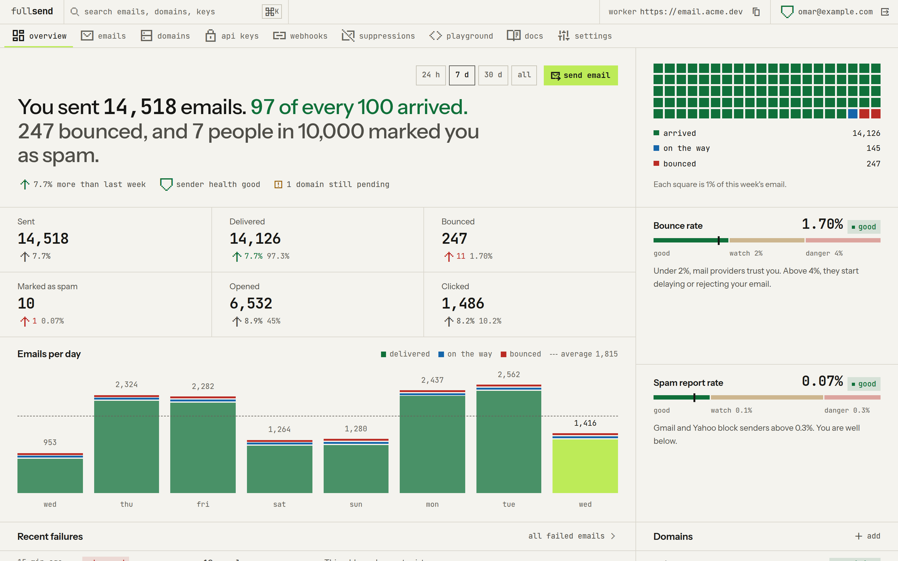

<div align="center">

<picture>
  <source media="(prefers-color-scheme: dark)" srcset="logo-dark.svg">
  
</picture>

**An email API that runs completely on Cloudflare.**

A drop-in replacement that can use the `resend` SDK, with [some limits](#differences-from-resend).

<a href="https://deploy.workers.cloudflare.com/?url=https://github.com/omznc/fullsend">
  
</a>

[Deploy](#deploy) · [Send](#send) · [RPC](#service-binding-rpc) · [API](#api) · [Develop](#develop)

</div>

<br>

<picture>
  <source media="(prefers-color-scheme: dark)" srcset="docs/overview-dark.png">
  
</picture>

---

## Deploy

1. **Click "Deploy to Cloudflare".**
   The deploy makes the D1 database, the R2 bucket and the three queues.

2. **Fill in the deploy form.**
   The form needs no values.

> [!IMPORTANT]
> Keep **"Protect with Cloudflare Access"** off. fullsend makes its own
> Access applications, and the API paths must stay public.

3. **Open the Worker URL.**
   The setup page shows the remaining steps.

> [!NOTE]
> If you rename a queue or the Worker in the deploy form, set
> `EVENTS_QUEUE_NAME` or `WORKER_NAME` to the new name.

<details>
<summary><strong>Deploy by hand</strong></summary>

<br>

The `deploy` script applies the D1 migrations before it deploys. On a new
account, make the database first:

```sh
pnpm install
pnpm build                          # the dashboard, into ui/dist
pnpm exec wrangler d1 create fullsend
pnpm run deploy
```

Then open the Worker URL.

fullsend makes its session secret and its setup code in D1. To set your own
values, set the `SESSION_SECRET` or `SETUP_TOKEN` secret with
`pnpm exec wrangler secret put`.

</details>

<details>
<summary><strong>Update a deploy</strong></summary>

<br>

The Deploy button makes a copy of this repo, not a fork, so GitHub cannot
sync it. Cloudflare also writes the D1 database ID into `wrangler.jsonc` of
the copy, and it removes `.github/workflows/ci.yml`. Apply the new changes
as a patch, then push. The push deploys the Worker.

For the first update, set `OLD` to the commit of this repo that you
deployed. Run `OLD=<commit>` before the commands. After that, the commands
read it from the last update commit. The subject of that commit ends with
the commit hash. Do not change the end of the subject.

The patch command excludes `ci.yml`, because the copy has no such file.

```sh
git clone git@github.com:<you>/fullsend.git && cd fullsend
git fetch https://github.com/omznc/fullsend.git main
OLD=${OLD:-$(git log -1 --format=%s | grep -o '[0-9a-f]\{7,\}$')}
NEW=$(git rev-parse --short FETCH_HEAD)
VERSION=$(git show FETCH_HEAD:package.json | grep -m1 '"version"' | grep -o '[0-9][0-9.]*')
git diff --binary "$OLD" "$NEW" | git apply --index --exclude=.github/workflows/ci.yml
git commit -m "update to omznc/fullsend v$VERSION $NEW"
git push
```

The commands work in bash and in zsh. After the deploy, check the version
in Settings in the dashboard, or in the `version` field of `GET /health`.
The version and the changes of each release are in `CHANGELOG.md`.

"No valid patches in input" means that the copy is up to date.

If the deploy uses Cloudflare Access, sync the public paths after the
update. Press the sync button in Settings, or send
`POST /api/settings/access/sync-paths`. Without the sync, Access shows the
login page on `/suppressions` and `/logs`.

If you made the Access applications by hand, Settings has no sync button
and the sync route returns 404. Add the destinations by hand to the Access
application that bypasses the API. Add `/suppressions`, `/suppressions/*`,
`/logs` and `/logs/*` on the API hostname. Do the same for each public
path that a later version adds. `PUBLIC_PATHS` in
`worker/src/public-paths.ts` lists them all.

</details>

---

## Send

Use the official `resend` SDK:

```ts
import { Resend } from "resend";

const resend = new Resend("fs_...", { baseUrl: "https://email.example.com" });

await resend.emails.send({
  from: "Acme <hello@email.example.com>",
  to: ["omar@example.net"],
  subject: "Hello",
  html: "<p>Hello</p>",
});
```

> [!TIP]
> You can also set the `RESEND_BASE_URL` environment variable.

With curl:

```sh
curl https://email.example.com/emails \
  -H "Authorization: Bearer fs_..." \
  -H "Content-Type: application/json" \
  -d '{"from":"hello@email.example.com","to":"omar@example.net","subject":"Hello","text":"Hello"}'
```

---

## Service binding (RPC)

A Worker in the same account can call fullsend with no HTTP and no API key.
Copy [`rpc.d.ts`](rpc.d.ts) into the caller.

```jsonc
// wrangler.jsonc of the caller
"services": [
  {
    "binding": "FULLSEND",
    "service": "fullsend",
    "entrypoint": "FullsendRpc",
    "props": { "caller": "my-worker" }
  }
]
```

```ts
const { data, error } = await env.FULLSEND.sendEmail({
  from,
  to,
  subject,
  html,
});
```

| Method       | Method        | Method        |
| ------------ | ------------- | ------------- |
| `sendEmail`  | `sendBatch`   | `getEmail`    |
| `listEmails` | `updateEmail` | `cancelEmail` |

The methods take the Resend request bodies (the API names or the SDK names)
and return `{ data, error }`. fullsend stores each RPC email with the API key
column `rpc:<caller>`.

---

## API

The request bodies, the responses and the error names are the same as in
Resend. `Idempotency-Key` and `x-batch-validation` work as in Resend.

[`openapi.json`](openapi.json) describes each public route in OpenAPI 3.1.
It has the request bodies, the responses, the error shape, the bearer
auth and the two headers. The Worker does not serve the file. A test fails
when a public route and the file differ.

**Emails**

| Method  | Path                                              |
| ------- | ------------------------------------------------- |
| `POST`  | `/emails`                                         |
| `POST`  | `/emails/batch`                                   |
| `GET`   | `/emails`, `/emails/:id`                          |
| `PATCH` | `/emails/:id`                                     |
| `POST`  | `/emails/:id/cancel`                              |
| `GET`   | `/emails/:id/attachments`                         |
| `GET`   | `/emails/:id/attachments/:attachment_id`          |
| `GET`   | `/emails/:id/attachments/:attachment_id/download` |
| `GET`   | `/emails/metrics`                                 |

The attachment routes return a `download_url`. The URL is signed and
expires after one hour. It needs no API key. It returns 404 after the
retention period deleted the body of the email.

`/emails/metrics` counts the email events in D1. It supports the `period`,
`domain` and `email` dimensions, the `domain_id` and `email_id` filters and
all four granularities, in UTC. Each rate is a percent with one decimal
(`50.0`), as in Resend. A `period` is a date (`2026-07-01`) for the daily,
weekly and monthly granularity. For the hourly granularity it is a full
UTC datetime, because the Resend docs show no hourly example. fullsend does
not clamp an old `start_date` to a retention window.

**Domains**

| Method   | Path                              |
| -------- | --------------------------------- |
| `POST`   | `/domains`, `/domains/:id/verify` |
| `GET`    | `/domains`, `/domains/:id`        |
| `PATCH`  | `/domains/:id`                    |
| `DELETE` | `/domains/:id`                    |

**API keys**

| Method   | Path            |
| -------- | --------------- |
| `POST`   | `/api-keys`     |
| `GET`    | `/api-keys`     |
| `PATCH`  | `/api-keys/:id` |
| `DELETE` | `/api-keys/:id` |

**Webhooks**

| Method | Path                                               |
| ------ | -------------------------------------------------- |
| `*`    | `/webhooks`, `/webhooks/:id`                       |
| `POST` | `/webhooks/:id/signing-secret/rotate`              |
| `GET`  | `/webhooks/:id/events`, `/webhooks/:id/events/:id` |
| `GET`  | `/webhooks/:id/events/:id/attempts`                |
| `POST` | `/webhooks/:id/events/:id/replay`                  |

Webhooks use the Resend body and Svix signatures. `resend.webhooks.verify()`
and the `svix` package check them. A webhook accepts each event type of the
Resend SDK. fullsend sends the `email.*` events (except `email.received`),
`suppression.added`, `suppression.removed` and `domain.updated`.

**Suppressions**

| Method   | Path                                 |
| -------- | ------------------------------------ |
| `POST`   | `/suppressions`                      |
| `GET`    | `/suppressions`, `/suppressions/:id` |
| `DELETE` | `/suppressions/:id`                  |
| `POST`   | `/suppressions/batch/add`            |
| `POST`   | `/suppressions/batch/remove`         |

In a `:id` position, a suppression route accepts an id or an email address.

**Logs**

| Method | Path                 |
| ------ | -------------------- |
| `GET`  | `/logs`, `/logs/:id` |

These routes need a full access key. They read the request log (see below).

**Lists**

`GET /emails`, `/domains`, `/api-keys`, `/webhooks`, `/suppressions`,
`/logs` and the event and attachment lists use the Resend cursor pages (`limit`, `after`,
`before`).

### Differences from Resend

| Area                  | fullsend                                                                                     |
| --------------------- | -------------------------------------------------------------------------------------------- |
| Email size            | 5 MiB or less, with attachments. This is the Cloudflare limit.                               |
| `path` attachments    | 10 or fewer in one email. fullsend fetches them one by one.                                  |
| `reply_to`            | Cloudflare sends only the first address.                                                     |
| Missing features      | No templates, audiences, contacts, broadcasts or receiving.                                  |
| Missing endpoints     | No `POST /emails/:id/share`, `/domains/claim`, `/usage`, `/events`, `/segments`, `/topics`.  |
| Logs                  | No request body, `user_agent` or body of a success response. The log keeps 14 days.          |
| Domain `region`       | Only `global`. Any other value gives a 422.                                                  |
| Domain `tls`          | Only `opportunistic`. `enforced` gives a 422.                                                |
| Domain fields         | `custom_return_path` must be `send`. `tracking_subdomain` gives a 422.                       |
| Domain `capabilities` | `sending` must be `enabled` and `receiving` must be `disabled`. Any other value gives a 422. |
| Tracking              | Open and click tracking are on by default for a new domain.                                  |
| Domains               | Must be in a Cloudflare zone of the same account.                                            |
| Rate limit            | The limit per key has steps of 10 requests per second.                                       |
| Suppression ids       | An id is `sup_` and the base64url address, not a UUID.                                       |
| Suppression batch     | 100 addresses or fewer in one request.                                                       |
| Metrics               | UTC only. No `received`, `unsubscribed` or broadcast data.                                   |
| Webhook events        | Each type is accepted. fullsend does not send contact, topic or receiving events.            |
| Event attempts        | An attempt with no response has `http_status_code` 0.                                        |

#### Ignored emails

People test with bad addresses, and the bounces stay in the stats. In the
dashboard, open a bounced, failed or complained email and select "ignore".
An ignored email does not count in the overview, in the recent failures or
in `GET /emails/metrics`. The email stays in the Emails list with an
"ignored" mark. Select "stop ignoring" to count it again.

#### Request log

fullsend writes one log row for each request to a Resend API route that
has a valid API key. A request with a missing or wrong key has no row. A
`429` response has no row. The Logs screen and `GET /logs` show the rows.
A row has the time, the method, the path with its ids, the status, the API
key, the time taken and, for an error, the error name and message.

The log never stores a request body, a header or the API key. It stores
the error name and message of an error response, and no other response
body. The path has no query string. The `/t` tracking links, `/health`, the
dashboard `/api` and the static files are not in the log.

The retention job deletes the rows after 14 days. To stop the log, turn off
"Log API requests" in Settings (the `request_log` setting). The rows that
exist stay until the retention job deletes them.

> [!NOTE]
> A deploy that has Cloudflare Access must add each new public path to the
> "fullsend API" Access application. After an update, send
> `POST /api/settings/access/sync-paths` from the dashboard session. The
> setup does the same when it reuses the application. In a manual Access
> setup, add the new paths to the bypass application by hand.

---

## Webhooks

A webhook gets a `POST` with a JSON body for each event that it wants. The
body has the Resend shape: `type`, `created_at` and `data`.

fullsend sends these event types:

- `email.scheduled`, `email.sent`, `email.delivered`,
  `email.delivery_delayed`, `email.bounced`, `email.complained`,
  `email.opened`, `email.clicked`, `email.failed` and `email.suppressed`.
- `suppression.added` and `suppression.removed`.
- `domain.updated`. fullsend sends it when the status of a domain changes.

Example of an `email.*` event:

```json
{
  "type": "email.delivered",
  "created_at": "2026-10-01T12:00:05.000Z",
  "data": {
    "created_at": "2026-10-01T12:00:00.000Z",
    "email_id": "9b0f7c2e-6a1d-4c53-8f0e-2d1a7c9e4b11",
    "from": "Acme <hello@email.example.com>",
    "to": ["omar@example.net"],
    "subject": "Hello",
    "message_id": "<abc123@email.example.com>"
  }
}
```

The `suppression.*` and `domain.updated` events follow the Resend shapes.
The `bounced`, `clicked` and `failed` events add a `bounce`, `click` or
`failed` object to `data`.

Each request has the Svix signature headers:

| Header                                                 | Value                                                 |
| ------------------------------------------------------ | ----------------------------------------------------- |
| `svix-id`                                              | The message ID. A retry keeps it.                     |
| `svix-timestamp`                                       | The time of the attempt, in seconds.                  |
| `svix-signature`                                       | `v1,` and the HMAC-SHA256 signature.                  |
| `webhook-id`, `webhook-timestamp`, `webhook-signature` | The same values, for the Standard Webhooks libraries. |

Use `resend.webhooks.verify()` or the `svix` package to check a request.

A response with a 2xx status code ends the delivery. Any other response, a
network error or no answer in 15 seconds fails the attempt. After a failed
attempt, fullsend tries again with these delays:

| Attempt | 1   | 2     | 3      | 4   | 5   | 6    | 7    | 8       |
| ------- | --- | ----- | ------ | --- | --- | ---- | ---- | ------- |
| Delay   | 5 s | 5 min | 30 min | 2 h | 5 h | 10 h | 10 h | No more |

The delay in a column is the wait after that attempt. After attempt 8,
fullsend stops and writes a warning in the system events. Read them with
`GET /api/system-events` in the dashboard API. To send a stored event again, use
`POST /webhooks/:id/events/:id/replay`.

---

## Develop

**Requirements:** Node 24 and pnpm.

```sh
pnpm install
cp .dev.vars.example .dev.vars   # set AUTH_MODE=dev for a local dashboard
pnpm build                       # the UI, into ui/dist
pnpm dev                         # the Worker, on port 8787
pnpm dev:ui                      # the UI with hot reload, on port 5173
```

**Checks:**

```sh
pnpm lint:ci
pnpm typecheck
pnpm test
```

The tests run in the Workers runtime. One suite runs the official `resend`
SDK against the Worker.

**Browser smoke test:**

```sh
pnpm --filter @fullsend/ui exec playwright install chromium   # one time
pnpm test:e2e
```

The test builds the UI and starts the Worker on port 8799 with
`AUTH_MODE=dev`, an empty local D1 database and no Cloudflare token. It
opens the main screens, adds a webhook and reads the version in the
settings. `pnpm test` does not run it. The `e2e` job in CI runs it.

**Make an API key without the dashboard:**

```sh
cd worker
node scripts/create-key.ts "my app" > key.sql
cf d1 execute fullsend --remote --file key.sql
```

### Layout

```
wrangler.jsonc        the Worker config and every binding
worker/
├── src/              the Worker
│   ├── api/          the Resend-compatible routes
│   ├── dashboard/    /api/* for the UI
│   ├── send/         validation, idempotency, the send queue consumer
│   ├── events/       Cloudflare events to email status and webhooks
│   ├── webhooks/     webhook delivery and signing
│   ├── tracking/     the open pixel and the click redirect
│   ├── domains/      domains through the Cloudflare API
│   └── db/           the Drizzle schema
└── migrations/       D1 migrations
ui/                   the dashboard
rpc.d.ts              the RPC types for callers
```

---

## License

[AGPL-3.0-only](LICENSE).

## Thanks

This was inspired by [Emailflare](https://github.com/0xdps/emailflare), but it's not a fork.
